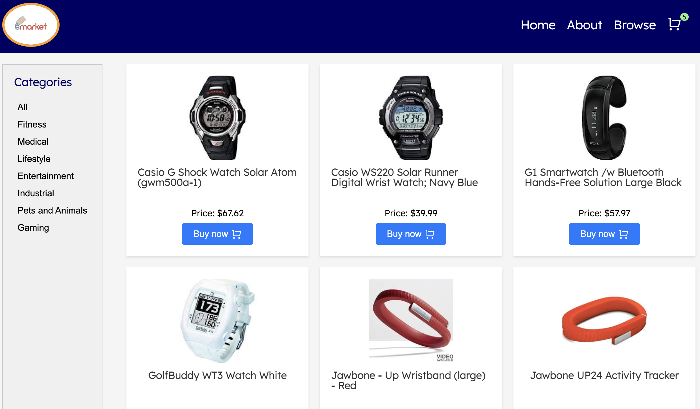
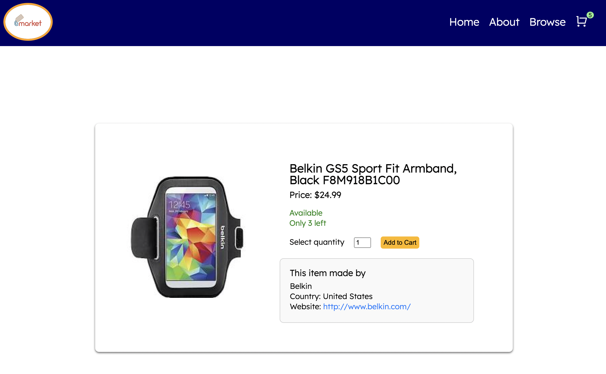
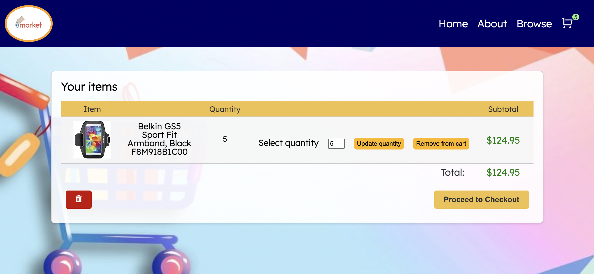
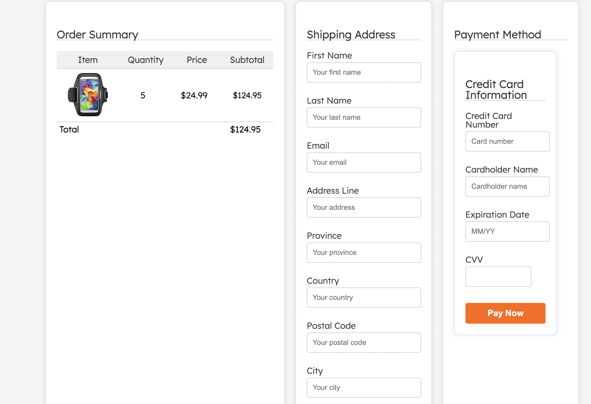

# eMarket

    

 

- Video demo availalbe at https://www.youtube.com/watch?v=039IS2WXHfA

## General Information
- eMarket is a full stack e-commerce web application for purchasing wearable technologies. 
- This was a group project (3 participants) for Concordia University's intensive Full Stack Web Development diploma. 

## Technologies Used
- React 
- useReducer hook to manage cart data
- Node.JS
- Express.JS
- MongoDb
- Git Version Control
- styled-components
- Material UI react tools (MUI)
- Javascript/CSS/HTML
- RESTful APIs

## Features
- Browse feature with category filters and pagination (50 items per page)
- Persistent cart data (via MongoDb)
- Client-side form verification to ensure users do not select quantities greater than the amount in stock for each item. 

# Setup

### Frontend

1. Open a terminal in VS Code
2. Type `cd client`
3. Type `yarn install`

Type `yarn start` to start the frontend dev environment.

### Backend

1. Open a second terminal in VS Code
2. Type `cd server`
3. Type `yarn install`

Type `yarn start` to start the backend dev environment.

## The App 

Landing page 

Browse page, where users can browse all items, or filter by category. Pagination implemented to limit results to 50 per page. 

Page for each individual item, where you can add the item to the cart. User is limited to the quantity available in stock, which is updated in local state. 

The cart, where users can update quantities, delete items, or clear entire cart. From here they can proceed to a checkout page. 

Checkout page, with both client side and server side verification of fields. 

